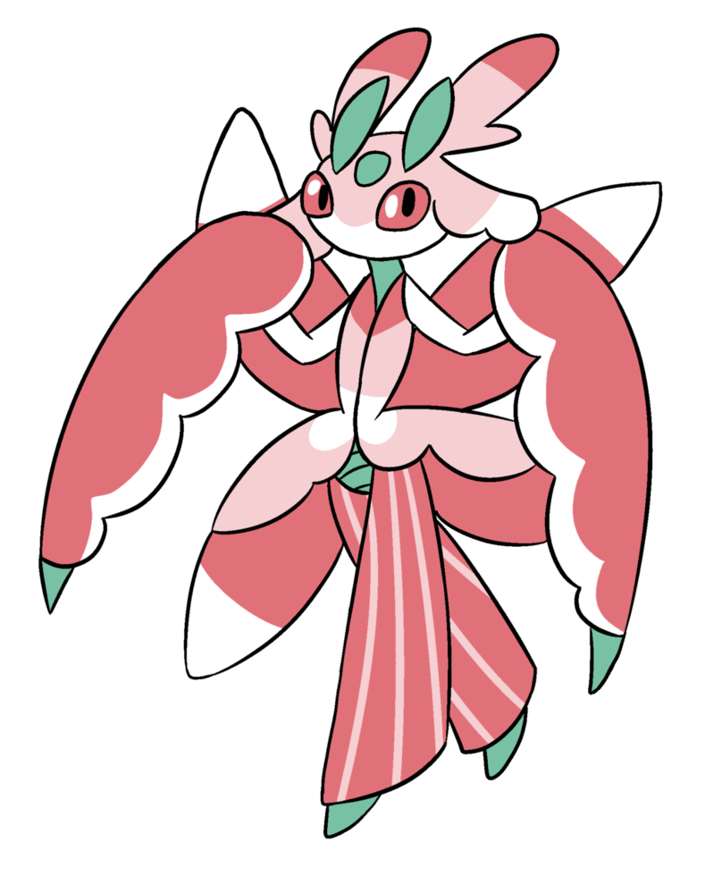
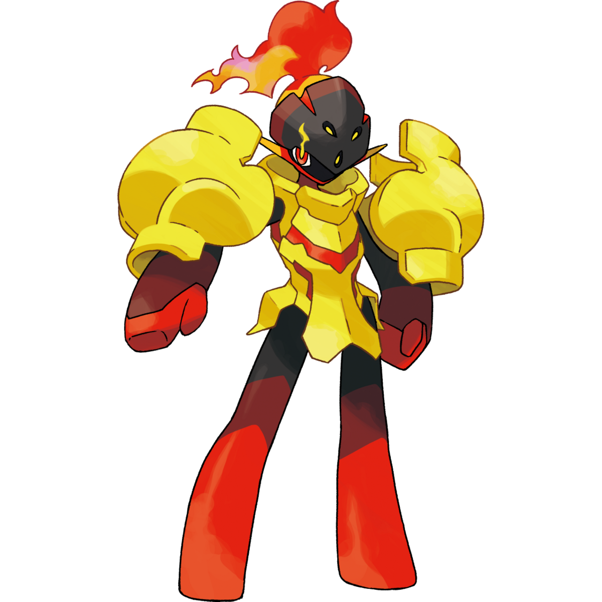
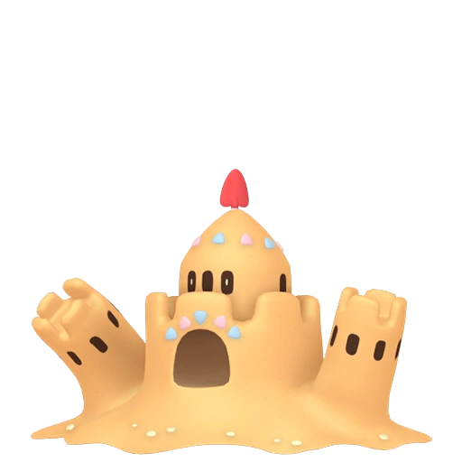

# Slowbro
<picture>

</picture>

### Nature
Relaxed

### Held Item
Heavy-Duty Boots

### Moveset
Scald
 
Future Sight
 
Slack Off
 
Teleport

### EV
252 HP / 252 Def / 4 SpD

### Ability
Regenerator

<h3><ins>Summary</ins></h3>
A defensive Trick Room setter, paired with teleport for switching in and out without receiving hazard damage

# Lurantis
<picture>

</picture>

### Nature
Modest

### Held Item
Choice Scarf

### Moveset
Defog
 
Leaf Storm
 
Synthesis
 
Toxic

### EV
252 Def / 252 SpA / 4 SpD

### Ability
Contrary

<h3><ins>Summary</ins></h3>
An offensive Special Attack sweeper who uses the pairing of Leaf Storm and Contrary to boost SpA when sweeping.

# Appletun
<picture>

</picture>

### Nature
Modest

### Held Item
Some berry??

### Moveset
Dragon Pulse
 
Draco Meteor
 
Apple Acid
 
Leech Seed

### EV
252 SpA / 252 HP / 4 Def 

### Ability
Ripen

<h3><ins>Summary</ins></h3>
A tanky special attacker that can use Apple Acid to prep for a special attack sweep or do some damage on his own. Can also setup leech seed to be annoying.

# Armarouge
<picture>

</picture>

### Nature
Quiet

### Held Item
Life Orb

### Moveset
Armor Cannon 
 
Trick Room
 
Psychic
 
Protect

### EV
252 HP / 252 SpA / 4 SpD 

### Ability
Flash Fire

<h3><ins>Summary</ins></h3>
A trick room setter and special attacker. 

# Hippowdon
<picture>

</picture>

### Nature
Careful

### Held Item
Leftovers

### Moveset
Earthquake
 
Slack Off
 
Stealth Rock
 
Whirlwind

### EV
252 HP / 252 SpD / 4 Def 

### Ability
Sand Stream

<h3><ins>Summary</ins></h3>
A tanky physical attacker with entry hazards and sandstorm setup. Opener for Palossand and Shore Up.

# Palossand
<picture>

</picture>

### Nature
Bold

### Held Item
Leftovers

### Moveset
Shadow Ball
 
Earth Power
 
Stealth Rock
 
Shore Up

### EV
252 HP / 252 Def / 4 SpD 

### Ability
Sand Stream

<h3><ins>Summary</ins></h3>
A tanky defensive stall that capitalizes on sand stream to get more evasion and shore up to heal.

